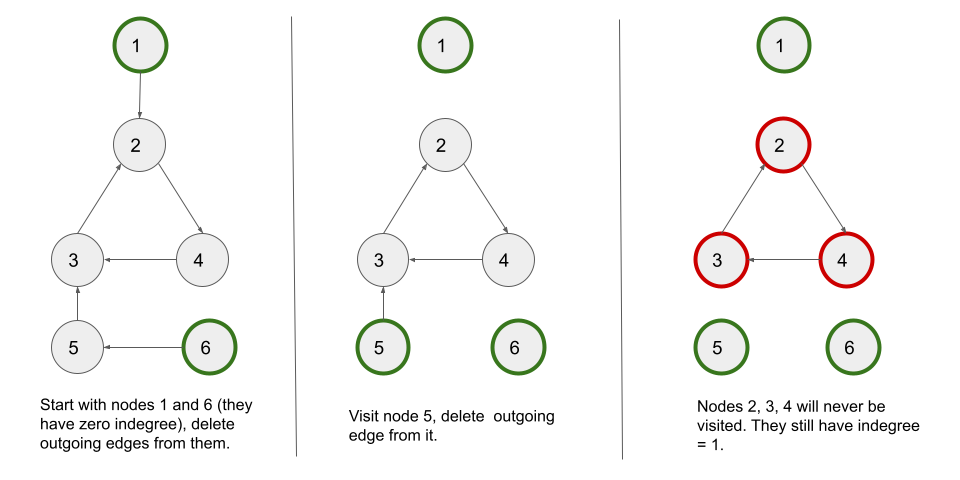

# 문제

[207. Course Schedule](https://leetcode.com/problems/course-schedule/description/)

# 코드

```js
var canFinish = function (numCourses, prerequisites) {
  let adj = {};
  let indegree = Array(numCourses).fill(0);

  for (let i = 0; i < numCourses; i++) {
    adj[i] = [];
  }

  for (const [a, b] of prerequisites) {
    adj[b].push(a);
    indegree[a]++;
  }

  const queue = [];
  for (let i = 0; i < numCourses; i++) {
    if (indegree[i] === 0) queue.push(i);
  }

  let nodesVisited = 0;
  while (queue.length) {
    node = queue.shift();
    nodesVisited++;

    for (let neighbor of adj[node]) {
      indegree[neighbor]--;
      if (indegree[neighbor] === 0) {
        queue.push(neighbor);
      }
    }
  }

  return nodesVisited === numCourses;
};
```

# 풀이

주어진 선수과목(prerequisites)을 고려하여 모든 과목을 수강할 수 있는지 여부를 판단하는 문제입니다.

해당 조건들을 토대로 그래프를 만들고 내부에 사이클이 있는지를 확인하는 문제입니다. 만약 그래프에 사이클이 있다면 선행 과목들이 서로 교차되면서 수강할 수 없는 과목들이 있는 것입니다.

# 그래프 위상 정렬(Kahn's algorithm, Topological Sort)

Kahn's algorithm은 그래프의 위상 정렬을 수행하기 위한 알고리즘 중 하나입니다. 위상 정렬은 방향 그래프에서 각 노드를 선행 순서에 따라 정렬하는 것을 의미합니다. 이 알고리즘은 선수과목을 고려한 강의 수강 가능성 판단 등, 의존 관계를 가진 작업을 처리하는 데 유용하게 사용됩니다.

Kahn's algorithm은 다음과 같은 단계로 이루어집니다.

1. 모든 노드의 진입차수(indegree)를 계산합니다. 진입차수는 특정 노드로 들어오는 간선의 수를 의미합니다.

2. 진입차수가 0인 모든 노드를 큐에 추가합니다.

3. 큐에서 노드를 하나씩 추출하고, 해당 노드와 연결된 간선을 제거합니다. 간선 제거로 인해 진입차수가 0이 된 노드는 큐에 추가합니다.

4. 큐가 빌 때까지 3번 단계를 반복합니다.

5. 반복이 완료되면, 큐에서 추출한 노드들의 순서가 위상 정렬 결과입니다.

   Kahn's algorithm을 활용하여 위상 정렬을 수행하면, 모든 노드를 순서에 맞게 정렬할 수 있습니다. 만약 그래프에 순환 의존성이 존재한다면, 모든 노드를 순서에 맞게 정렬하는 것이 불가능하므로, 이를 활용하여 강의 수강 가능성 등을 판단할 수 있습니다.


