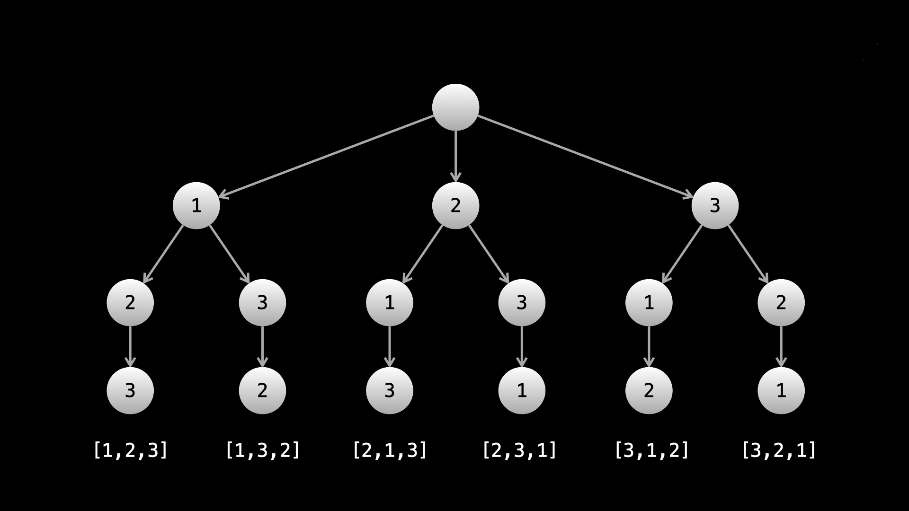

# 문제

[46. Permutations](https://leetcode.com/problems/permutations/)

# 코드

```js
var permute = function (nums) {
  const result = [];
  const dfs = (path) => {
    if (path.length === nums.length) {
      result.push([...path]);
      return;
    }
    for (let i = 0; i < nums.length; i++) {
      if (path.includes(nums[i])) continue;
      path.push(nums[i]);
      dfs(path);
      path.pop();
    }
  };
  dfs([]);
  return result;
};
```

# 풀이


DFS, BackTracking 기법으로 모든 경우의 수를 완전탐색합니다.
