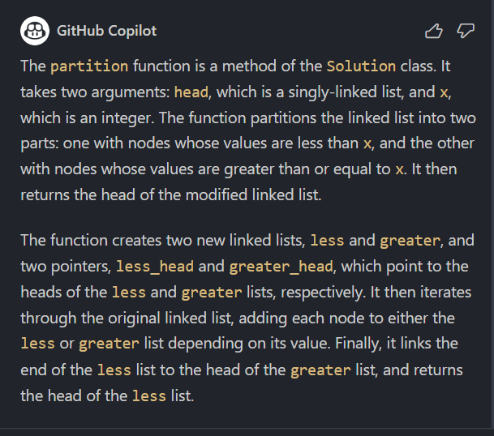

# 문제

[86. Partition List](https://leetcode.com/problems/partition-list/description/)

# 코드

```py
class Solution:
    def partition(self, head: Optional[ListNode], x: int) -> Optional[ListNode]:
        less, greater = ListNode(), ListNode()
        less_head, greater_head = less, greater
        while head:
            if head.val < x:
                less.next = head
                less = less.next
            else:
                greater.next = head
                greater = greater.next
            head = head.next
        greater.next = None
        less.next = greater_head.next
        return less_head.next
```

# 풀이

copilot 채팅 기능 처음으로 사용해 보았습니다! x보다 큰 값, 작은 값을 저장할 연결 리스트를 각각 만들고 이후에 둘을 연결하여 retrun 해줍니다.


